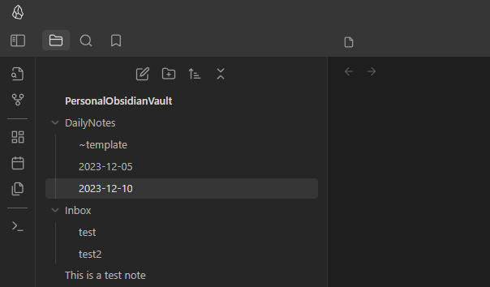
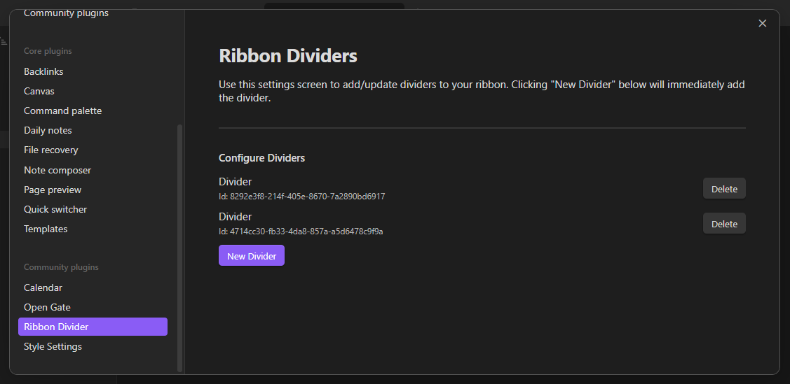

[)](https://obsidian.md/plugins?id=ribbon-divider)

# Obsidian Ribbon Divider

A plugin for Obsidian.MD that allows you to add dividers to the ribbon to space out your icons.



## How to Install

Plugin can be installed from the official plugin list.

[Install Ribbon Divider](https://obsidian.md/plugins?id=ribbon-divider)

## How to Use

Dividers can be added and removed via the settings screen. Once they are added, you can drag them directly in the ribbon to where you want them just like an icon.



## Customization

To customize the appearance of the dividers, you can utilize CSS to target the element.

```css
/* Example: Change spacing around diver */
.side-dock-actions .side-dock-ribbon-action.ribbon-divider {
	padding: 8px 0;
}

/* Example: Change width of divider */
.side-dock-actions .side-dock-ribbon-action.ribbon-divider {
	width: 50%;
}

/* Example: Change color of divider */
.side-dock-actions .side-dock-ribbon-action.ribbon-divider &:before {
	background-color: #ff0000;
}
```

If you want to target a _specific_ divider, each divider has a class added that incldues it's unique id (found in settings).

For example, to target a divider with the id `4714cc30-fb33-4da8-857a-a5d6478c9f9a`:

```css
/* Example: Change spacing around a specific diver */
.side-dock-actions
	.side-dock-ribbon-action.ribbon-divider.ribbon-divider-4714cc30-fb33-4da8-857a-a5d6478c9f9a {
	padding: 8px 0;
}
```

## Dealing with Obsidian's Icon Order Bug

Unfortunately Obsidian comes with a ribbon icon-order bug where you may have noticed that plugins don't keep the order you arranged them within the ribbon when disabling/re-enabling those plugins _(sometimes even when updating them)_ therefore making the dividers show up in the wrong places as well.

If you find yourself in situations where you have to toggle plugins or if you experience icon ordering issues in the ribbon, then below you'll find a workaround using [CSS snippets](https://help.obsidian.md/Extending+Obsidian/CSS+snippets):

1. Make note of the ribbon icons' tooltips because you have to copy the exact tooltip text inside the CSS snippet to be able to identify & order them as you wish
2. Create a CSS Snippet and first add the following CSS line to make all new plugin icons show up last after all your current icons:

```css
div.clickable-icon { order: 99; }
```

3. Think of how many groups of icons you wish to separate with dividers then add that many dividers in the Divider settings, then start creating your first group of icons in the CSS snippet as below:

```css
div[aria-label="Open graph view"] { order: 1; }
div[aria-label="Create new canvas"] { order: 2; }
```

4. Add your first divider as follows _(I placed it "9th" to make room for future icons in this first group)_:

```css
.ribbon-divider { order: 9 !important; }
```

5. Create another group of icons like in step 3, but for each subsequent divider added you will have to use the CSS `+` sibling selector _(this is because CSS doesn't have any "nth-class" selector to target dividers specifically)_:

```css
/* second divider */
.ribbon-divider + .ribbon-divider { order: 19 !important; }

/* third divider */
.ribbon-divider + .ribbon-divider + .ribbon-divider { order: 29 !important; }

/* and so on */
```

6. Finally, your CSS snippet should look similar to the below one:

```css
/* make sure new icons show up after all current icons */
div.clickable-icon { order: 99; }

/* this plugin changes tooltip when it's clicked, hence the same order '1' */
div[aria-label="Hide hidden folders again"] { order: 1; }
div[aria-label="Show hidden folders"] { order: 1; }
.ribbon-divider { order: 9 !important; }

/* second group of icons */
div[aria-label="Open graph view"] { order: 10; }
div[aria-label="Create new canvas"] { order: 11; }
div[aria-label="Create new drawing"] { order: 12; }
.ribbon-divider + .ribbon-divider { order: 19 !important; }

/* third group */
div[aria-label="Insert template"] { order: 20; }
div[aria-label="Templater"] { order: 21; }
div[aria-label="Open projects"] { order: 22; }
.ribbon-divider + .ribbon-divider + .ribbon-divider { order: 29 !important; }

/* fourth group */
div[aria-label="New encrypted note"] { order: 30; }
div[aria-label="Convert to or from an Encrypted note"] { order: 31; }
div[aria-label="Run local backup"] { order: 32; }
div[aria-label="Open Notion"] { order: 33; }
div[aria-label="Open Todoist"] { order: 34; }
.ribbon-divider + .ribbon-divider + .ribbon-divider + .ribbon-divider { order: 39 !important; }
```

## Reporting Issues

If you run into any issues with this plugin, please [open an issue](https://github.com/andrewmcgivery/obsidian-ribbon-divider/issues/new) and incude as much detail as possible, including screenshots.

# Leave a Tip

<a href="https://www.buymeacoffee.com/andrewmcgivery" target="_blank"></a>
